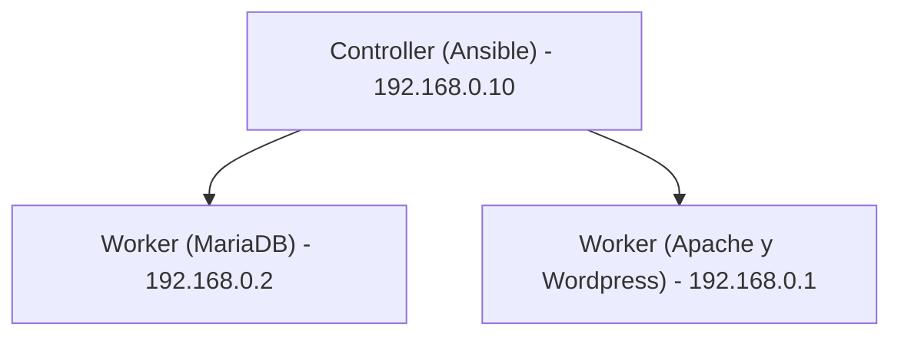

# Despliegue de Wordpress usando Vagrant y Ansible

El Objetivo de este proyecto es desplegar Wordpress usando Vagrant y Ansible.

## Requisitos

- Necesitas tener instalado VirtualBox 7.0 o superior (https://www.virtualbox.org)

- Necesitas tener instalado Git
```bash
# En Ubuntu/Debian
sudo apt-get update
sudo apt-get install git

# En Red Hat/Fedora
sudo yum install git

# En MacOs
brew install git

# En Windows
Puedes descargar e instalar Git desde https://git-scm.com
Durante la instalación, asegúrate de seleccionar la opción "Git from the command line and also from 3rd-party software".
```

- Necesitas tener instalado Ansible
```bash
# En Ubuntu/Debian
sudo apt-get update
sudo apt-get install ansible

# En Red Hat/Fedora
sudo dnf install ansible

# En MacOs
brew install ansible


- Necesitas tener instalado Vagrant 2.3.7 o superior
```bash
# En Ubuntu/Debian
sudo apt-get update
sudo apt-get install vagrant

# En Red Hat/Fedora
sudo dnf install vagrant

# En MacOs
brew install vagrant

# En Windows
Descarga el instalador de Vagrant desde el sitio web oficial de [Vagrant](https://www.vagrantup.com).
Ejecuta el instalador y sigue las instrucciones en pantalla.
```


- Ruby 2.5 o superior 
```bash
# En Ubuntu/Debian
sudo apt-get update
sudo apt-get install ruby-full

# En Red Hat/Fedora
sudo dnf install ruby

# En MacOs
brew install ruby

# En Windows
Descarga el instalador de RubyInstaller desde el sitio web oficial de[RubyInstaller](https://rubyinstaller.org).
Ejecuta el instalador y sigue las instrucciones en pantalla.
```


## Arquitectura

El proyecto se compone de tres servicios, cada uno deployado en una VM individual:

- [mysql](#): En esta VM se instala el worker - MariaDB.
- [wordpress](#): En esta VM se instala el worker - servidor  Apache y Wordpress.
- [ansible](#): Em esta VM se instala el Controller - Ansible.


## Configuración previa

En el archivo `Vagrantfile` se definen valores como las IPs de las VMs, y el usuario y password.

Antes de levantar Vagrant se define la caja que se usará. Mira el siguiente diagrama:



## Iniciar las VM's

1. Para levantar las tres máquinas virtuales con Debian ejecuta el comando:

```bash
 vagrant up
```

2. Agrega una entrada DNS estática en el hosts 
```
echo "127.0.0.1 www.wordpress.local" >> /etc/hosts
```

3. Para acceder a wordpress utiliza la siguiente URL(*)
```
http://www.wordpress.local:8080/wordpress
```
(*) El puerto 8080 debe estar libre.

4. Completa los parámetros en la instalación web de wordpress
```
base de datos : wordpress
usuario : wordpress
password: wordpress
host: 192.168.0.2
```


# Referencias de Ansible

Una colección de recursos esenciales para aprender y dominar Ansible.

## Documentación Oficial y Herramientas

- **Documentación de Ansible**: Guías completas y referencias para todos los aspectos de Ansible.
  - [Documentación de Ansible](https://docs.ansible.com/ansible/latest/index.html)

- **Ansible Galaxy**: Un centro comunitario para compartir roles de Ansible.
  - [Ansible Galaxy](https://galaxy.ansible.com/)

- **AWX/Torre de Ansible**: La versión de código abierto de Ansible Tower, proporcionando una interfaz web y API REST para Ansible.
  - [AWX Project](https://www.ansible.com/products/awx-project)
  - [Ansible Tower](https://www.ansible.com/products/tower)

## Herramientas de Desarrollo y Pruebas

- **Molécula de Ansible**: Herramienta para probar roles de Ansible en múltiples plataformas.
  - [Ansible Molecule](https://molecule.readthedocs.io/en/latest/)

- **Lint de Ansible**: Una herramienta de línea de comandos para el análisis estático de playbooks, ayudando a adherirse a las mejores prácticas.
  - [Ansible Lint](https://ansible-lint.readthedocs.io/en/latest/)

Estos recursos son excelentes puntos de partida para cualquier persona que busque aprender más sobre Ansible, desde principiantes hasta usuarios avanzados.
